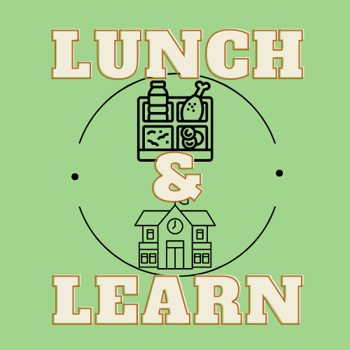
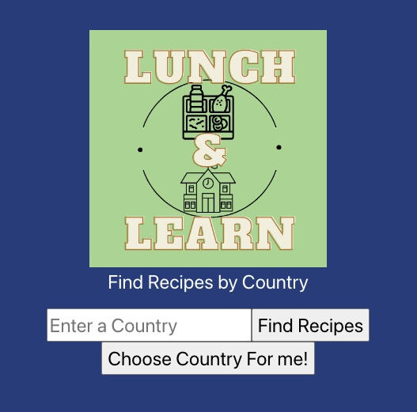

  

## Table of Contents
- [Introduction](#introduction)
- [Contributors](#contributors)
- [Technologies](#technologies)
- [Features](#features)
- [Learning Goals](#learning-goals)
<!-- - [Deployed Link](#deployed-link) -->
- [Future Extensions](#future-extensions)
- [Set Up](#set-up)
- [Sources](#sources)
- [Project Specs](#project-specs)
- [Project Repot](#project-repo)

## Introduction
Lunch and Learn allows users to look up recipes from a specific country and then find educational resources about that country. Users can register and login, allowing them to favorite specific recipes for later use.

## Contributors

[Andrew Mullins](https://github.com/mullinsand)

## Technologies
Front-End:

<!--  -->

 

Back-End:

<!--  -->

## Features
- Home page shows logo, search bar and random country selection button
 

  
 

  
- Users can search for recipes by country, with 10 results showing up per search.
 
- Each recipe provides a recipe link as well as a nice image of the dish.
 
 

  

 
- Error handling has also been implemented for erroneous searches.
 
 

  

 
<!-- - Users can signup for an account or simply explore the application, local storage gives users the ability to explore the app even through refresh. -->

<!-- - Users can see a list of all recipes for a country and favorite ones that they like for later use. -->
<!-- - 100% Lighthouse accessibility score. -->
<!-- - Mobile friendly views. -->
<!-- - Utilizes GraphQL and Apollo for a fast, easy to navigate application. -->
<!-- - Adopts third party libraries, such as Day.js, Google-Map-React and DatePicker.js to provide pre-tested functionality. -->
<!-- - Implements seperation of concerns to ensure the components used to render do just that and logic is seperated.  -->

## Learning Goals
- Learn how to make a multi-page react app with user authenication

## Deployed Link
<!-- - [Lunch&Learn on Vercel](https://fe-field-tripper-ftfe.vercel.app/) -->

## Future Extentsions
- Pagination for recipe search
- Login and User registration
- Favorites recipes

## Set Up
1. Fork and clone [this](https://github.com/mullinsand/lunch-and-learn-fe) repo
2. Type `cd FE-FieldTripper` to move into the root directory
3. Run `npm install` to install necessary dependencies
4. Run `npm start`
5. Copy local url given by running `npm start` and paste it to your browser

## Sources
- [MDN](http://developer.mozilla.org/en-US/)
- [W3Schools](https://www.w3schools.com/)

## Project Specs
- The spec for this project can be found [here](https://backend.turing.edu/module3/projects/lunch_and_learn/requirements)

## Project Repo
- The project BE repo can be found [here](https://github.com/mullinsand/lunch-and-learn)
- The project FE repo can be found [here](https://github.com/mullinsand/lunch-and-learn-fe)

